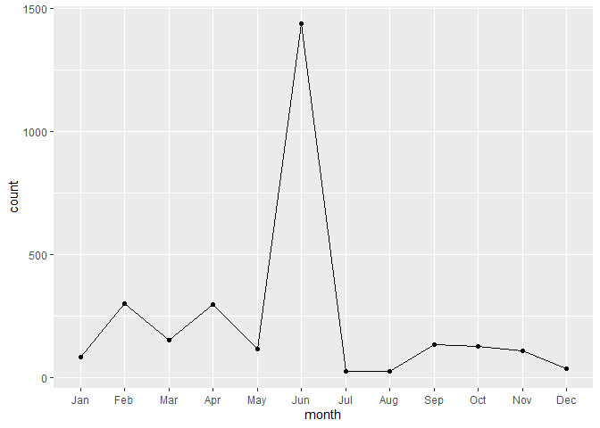

fdlp-purls
================

``` r
# load packages
library(tidyverse)
library(lubridate)
```

``` r
# import and combine monthly usage files
files <- dir(pattern = "purl_referrals_0633")
usage <- files %>%
  map(read_csv) %>%
  reduce(rbind)
```

``` r
# rename and convert variables
colnames(usage) <- c("timestamp", "host", "purl", "target", "sudoc", 
                     "title", "author", "pub_year", "pattern")
usage$timestamp <- ymd_hms(usage$timestamp)
usage$pub_year <- as.integer(usage$pub_year)
usage$pattern <- as.factor(usage$pattern)
```

``` r
# calculate total usage
total_usage <- nrow(usage)
print(total_usage)
```

    ## [1] 2839

``` r
# calculate number of unique resources accessed
unique_docs <- n_distinct(usage$purl)
print(unique_docs)
```

    ## [1] 690

``` r
# calculate usage by month
monthly_usage <- usage %>%
  group_by(month = month(timestamp, label = TRUE)) %>%
  summarize(count = n())
print(monthly_usage, n = 12)
```

    ## # A tibble: 12 x 2
    ##    month count
    ##    <ord> <int>
    ##  1 Jan      83
    ##  2 Feb     301
    ##  3 Mar     152
    ##  4 Apr     296
    ##  5 May     116
    ##  6 Jun    1439
    ##  7 Jul      26
    ##  8 Aug      26
    ##  9 Sep     132
    ## 10 Oct     125
    ## 11 Nov     107
    ## 12 Dec      36

``` r
monthly_usage %>%
  ggplot(aes(x = month, y = count, group = 1)) +
  geom_line() +
  geom_point()
```

<!-- -->
